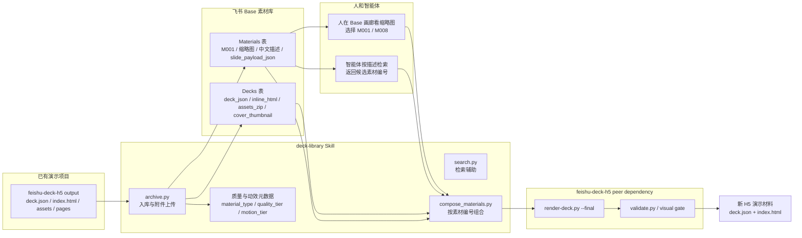

# feishu-deck-library-deck-h5

`deck-library` 是一个可独立安装的 Skill，用来把 `feishu-deck-h5` 生成的演示页沉淀成可复用的“页面级素材库”。它以飞书多维表格 Base 作为索引和素材管理界面，让人可以通过缩略图浏览素材，让智能体可以通过素材编号、描述和底层 `deck.json` payload 重新组合出新的 H5 演示材料。

这个仓库只包含上层素材库编排 Skill，不内置 `feishu-deck-h5` 渲染器。请把 `feishu-deck-h5` 当作 peer dependency / sibling Skill 安装。

## 它解决什么问题

- 把已有 H5 演示材料按“每页一个素材”归档，而不是只保存整份 deck。
- 在 Base 里为每页素材保存缩略图、中文描述、适用场景、页面价值和关键词。
- 给每页素材生成稳定编号，如 `M001`，便于人先在 Base 里挑选，再让智能体组合。
- 组合时不解析大体积渲染后 HTML，而是读取 `slide_payload_json` 重新生成标准 `deck.json`。
- 自动下载复用素材依赖的 `assets_zip`，恢复 `assets/` / `pages/`，再交给 `feishu-deck-h5` 渲染。
- 区分素材质量：`replica_screenshot` 只是截图复刻，`native_h5` 才是可高质量交付的 H5 页面。
- 记录动效质量：`has_motion`、`motion_tier`、`motion_notes`，让高质量 native H5 素材可带安全的 CSS-only subtle motion。

## 架构图



## 核心心智模型

- `Decks` 表保存整份 deck 的可复用附件和依赖包。
- `Materials` 表是主要素材库，一行就是一个页面级素材。
- `material_code` 是给人看的短编号，例如 `M001`。
- `material_id` 是稳定选择器，例如 `deck_demo:M001`。
- `slide_payload_json` 是组合新 deck 的底层来源，不要从渲染后 HTML 里反向抽取。
- `source_artifact_ref` 指向素材依赖，通常是 `base://deck/<deck_id>`。
- `assets_zip` 保存 `assets/` / `pages/` 等共享依赖，保证团队复用时不依赖归档者本地路径。

## Peer Dependency

`deck-library` 可以单独发布和安装，但目标环境必须已经安装 `feishu-deck-h5`，并且二者最好作为 sibling Skill 放置：

```text
skills/
  feishu-deck-h5/
  deck-library/
```

如果没有 `feishu-deck-h5`，本 Skill 仍可用于说明 Base schema、管理元数据和辅助检索，但不能声称可以渲染或验证最终 H5 交付物。

需要从 `feishu-deck-h5` 使用的工具：

- `skills/feishu-deck-h5/deck-json/render-deck.py`
- `skills/feishu-deck-h5/deck-json/deck-cli.py`
- `skills/feishu-deck-h5/assets/validate.py`

## 其他依赖

- Python 3
- `lark-cli`
- 飞书 / Lark Base 访问权限
- 符合 `skills/deck-library/references/base-schema.md` 的 `Decks` 和 `Materials` 表

## 配置

可以用命令行参数显式传入，也可以配置环境变量：

```bash
export DECK_LIBRARY_BASE_TOKEN="..."
export DECK_LIBRARY_DECKS_TABLE="..."
export DECK_LIBRARY_SLIDES_TABLE="..."
export DECK_LIBRARY_LARK_PROFILE="bytedance"
```

可复制 `.env.example` 作为本地配置模板。不要把真实 token 提交到仓库。

## 安装

把 `skills/deck-library/` 复制到目标智能体运行时的 `skills/` 目录，并确保旁边已经有 `feishu-deck-h5`：

```bash
cp -R skills/deck-library /path/to/runtime/skills/
```

检查本地依赖：

```bash
python3 skills/deck-library/assets/preflight.py
```

## 使用方式

归档一份已经渲染完成的 deck output：

```bash
python3 skills/deck-library/assets/archive.py runs/example/output --write \
  --base-token "$DECK_LIBRARY_BASE_TOKEN" \
  --decks-table "$DECK_LIBRARY_DECKS_TABLE" \
  --materials-table "$DECK_LIBRARY_SLIDES_TABLE"
```

按语义检索素材：

```bash
python3 skills/deck-library/assets/search.py "客户提案 AI 应用" \
  --base-token "$DECK_LIBRARY_BASE_TOKEN" \
  --materials-table "$DECK_LIBRARY_SLIDES_TABLE"
```

按素材编号组合新材料：

```bash
python3 skills/deck-library/assets/compose_materials.py M001 M008 M012 \
  --title "客户反馈分析材料" \
  --write \
  --base-token "$DECK_LIBRARY_BASE_TOKEN" \
  --decks-table "$DECK_LIBRARY_DECKS_TABLE" \
  --materials-table "$DECK_LIBRARY_SLIDES_TABLE" \
  --output-dir runs/composed/output
```

## Base 表设计

详细字段见 `skills/deck-library/references/base-schema.md`。核心字段包括：

- `Decks.deck_json`：原始 DeckJSON，复用的 source of truth。
- `Decks.inline_html`：渲染后 HTML 预览 / 交付附件。
- `Decks.assets_zip`：共享依赖包。
- `Materials.thumbnail`：页面缩略图，用于 Base 画廊浏览。
- `Materials.素材名称` / `素材描述` / `适用场景` / `页面价值` / `视觉类型` / `关键词`：中文浏览和检索字段。
- `Materials.slide_payload_json`：组合新 deck 的页面 payload。
- `Materials.material_type` / `quality_tier` / `fidelity_notes`：质量分层。
- `Materials.has_motion` / `motion_tier` / `motion_notes`：动效分层。

## 测试

```bash
python3 -m unittest discover -s skills/deck-library/tests -p 'test_*.py'
```

## 不要提交

- 真实 Base token
- 私有 table id，除非是刻意公开的示例
- `runs/`
- `.deck-library-cache/`
- 客户素材
- 含私有内容的渲染交付物

