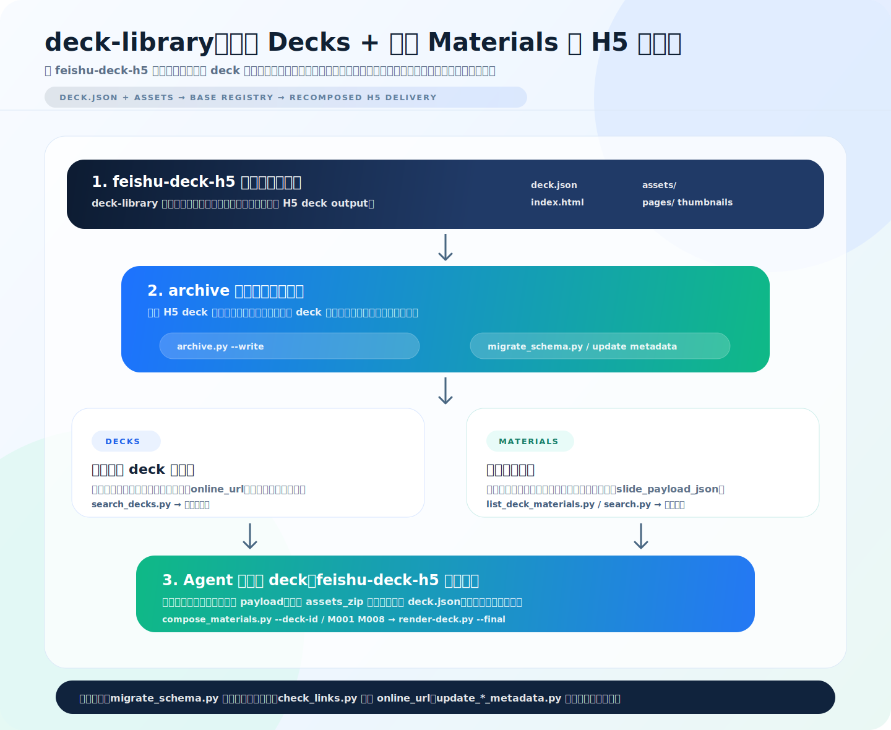

# feishu-deck-library-deck-h5

`deck-library` 是一个可独立安装的 Skill，用来把 `feishu-deck-h5` 生成的 H5 演示材料沉淀成团队可复用的 **完整 deck 库 + 页面素材库**。

它以飞书多维表格作为人和 Agent 共用的操作界面：

- `Decks` 表维护完整 deck：中文名称、描述、封面缩略图、线上链接、链接状态、附件包。
- `Materials` 表维护页面素材：每页缩略图、页面角色、复用状态、中文说明、底层 `slide_payload_json`。
- 人可以在多维表格里浏览完整材料、下钻页面、维护元数据。
- Agent 可以检索完整 deck、按 `deck_id` 下钻页面、按素材编号或页面角色重新组合 H5 deck。

这个仓库只包含上层库管理与编排 Skill，不内置 `feishu-deck-h5` 渲染器。请把 `feishu-deck-h5` 当作 peer dependency / sibling Skill 安装。

## 它解决什么问题

- 团队不只保存一次性交付文件，而是在 `Decks` 表统一维护完整 deck 条目：有线上链接时可直接打开，没有线上链接时也能保留附件和复用依赖。
- 每份完整 deck 又会拆成 `Materials` 页面素材，支持按封面、案例、数据页、收尾等页面角色复用。
- 多维表格同时服务人和 Agent：人看缩略图和中文说明，Agent 读结构化字段和 payload。
- 组合时不反向解析渲染后 HTML，而是读取 `slide_payload_json` 重新生成标准 `deck.json`。
- 复用时优先恢复 `Decks.assets_zip` 中的 `assets/` / `pages/` 依赖；如果归档时没有上传依赖包，则需要本地 `--asset-root` 或重新归档。
- 支持库治理：schema/view 迁移、可信托管域名的链接健康检查、受保护字段不可直接改、人工字段可安全更新、质量分层、动效分层。

## 架构与使用流程

先理解 `deck-library` 的来源：`deck-h5` / `feishu-deck-h5` 的基础产物是 `deck.json + index.html + assets/pages/images`。`deck-library` 站在这个产物之上，把一份 H5 deck 同时登记为完整 `Decks` 记录和页面级 `Materials` 记录，再用飞书多维表格管理、检索、组合和治理。



这张图可以理解为：`deck-library` 不是渲染器，而是 H5 deck 资产库编排层。完整材料先进入 `Decks`，页面再进入 `Materials`；人通过多维表格浏览和维护，Agent 通过 CLI 检索、下钻、组合；最终渲染、验证和交付仍由 sibling `feishu-deck-h5` 完成。

## Decks 和 Materials 怎么分工

这套库不是简单存文件，而是把一份 H5 deck 拆成两层资产：`Decks` 负责完整材料的登记、浏览和治理，`Materials` 负责页面级素材的检索、下钻和重新组合。

- `Decks` 表是一份完整 deck 的登记入口，一行对应一份 H5 演示材料。
- `Materials` 表是页面素材库，一行对应一个可复用页面。
- `deck_id` 是连接 `Decks` 和 `Materials` 的稳定主键。
- `online_url` 是完整 deck 的线上访问入口；没有线上链接时，Decks 记录仍可保存附件和复用依赖。
- `link_health` / `链接状态` / `last_checked_at` 用于治理线上链接是否还可用。
- `material_code` 是给人看的短编号，例如 `M001`。
- `material_id` 是稳定选择器，例如 `deck_demo:M001`。
- `slide_payload_json` 是组合新 deck 的页面来源，不从渲染后 HTML 反向抽取。
- `source_artifact_ref` 指向素材依赖，通常是 `base://deck/<deck_id>`。
- `assets_zip` 保存 `assets/` / `pages/` 等共享依赖；组合复用依赖它或本地 `--asset-root`。

## Peer Dependency

`deck-library` 可以单独发布和安装，但目标环境必须已经安装 `feishu-deck-h5`，并且二者最好作为 sibling Skill 放置：

```text
skills/
  feishu-deck-h5/
  deck-library/
```

如果没有 `feishu-deck-h5`，本 Skill 仍可用于说明 Base schema、管理元数据和辅助检索，但不能声称可以渲染或验证最终 H5 交付物。

需要从 `feishu-deck-h5` 使用的工具：

- `skills/feishu-deck-h5/deck-json/render-deck.py`
- `skills/feishu-deck-h5/deck-json/deck-cli.py`
- `skills/feishu-deck-h5/assets/validate.py`

## 其他依赖

- Python 3
- `lark-cli`
- 飞书 / Lark Base 访问权限
- 符合 `skills/deck-library/references/base-schema.md` 的 `Decks` 和 `Materials` 表

## 配置

可以用命令行参数显式传入，也可以配置环境变量：

```bash
export DECK_LIBRARY_BASE_TOKEN="..."
export DECK_LIBRARY_DECKS_TABLE="..."
export DECK_LIBRARY_SLIDES_TABLE="..."  # Materials 表；沿用历史环境变量名
export DECK_LIBRARY_LARK_PROFILE="bytedance"
```

可复制 `.env.example` 作为本地配置模板。不要把真实 token 提交到仓库。

## 安装

把 `skills/deck-library/` 复制到目标智能体运行时的 `skills/` 目录，并确保旁边已经有 `feishu-deck-h5`：

```bash
cp -R skills/deck-library /path/to/runtime/skills/
```

检查本地依赖：

```bash
python3 skills/deck-library/assets/preflight.py
```

## 使用方式

初始化或修复多维表格 schema / 视图：

```bash
python3 skills/deck-library/assets/migrate_schema.py --write \
  --base-token "$DECK_LIBRARY_BASE_TOKEN" \
  --decks-table "$DECK_LIBRARY_DECKS_TABLE" \
  --materials-table "$DECK_LIBRARY_SLIDES_TABLE"
```

归档一份已经渲染完成的 deck output，同时写入 `Decks` 和 `Materials`：

```bash
python3 skills/deck-library/assets/archive.py runs/example/output --write \
  --base-token "$DECK_LIBRARY_BASE_TOKEN" \
  --decks-table "$DECK_LIBRARY_DECKS_TABLE" \
  --materials-table "$DECK_LIBRARY_SLIDES_TABLE"
```

先检索完整 deck：

```bash
python3 skills/deck-library/assets/search_decks.py "客户提案 AI pitch deck" \
  --access-status ready \
  --base-token "$DECK_LIBRARY_BASE_TOKEN" \
  --decks-table "$DECK_LIBRARY_DECKS_TABLE"
```

从一份完整 deck 下钻页面素材：

```bash
python3 skills/deck-library/assets/list_deck_materials.py deck_20260704_001 \
  --base-token "$DECK_LIBRARY_BASE_TOKEN" \
  --materials-table "$DECK_LIBRARY_SLIDES_TABLE"
```

按语义检索素材：

```bash
python3 skills/deck-library/assets/search.py "客户提案 AI 应用" \
  --base-token "$DECK_LIBRARY_BASE_TOKEN" \
  --materials-table "$DECK_LIBRARY_SLIDES_TABLE"
```

按完整 deck 和页面角色组合新材料：

```bash
python3 skills/deck-library/assets/compose_materials.py \
  --deck-id deck_20260704_001 \
  --page-role 封面 --page-role 案例 --page-role 收尾 \
  --title "客户提案精选版" \
  --write \
  --base-token "$DECK_LIBRARY_BASE_TOKEN" \
  --decks-table "$DECK_LIBRARY_DECKS_TABLE" \
  --materials-table "$DECK_LIBRARY_SLIDES_TABLE" \
  --output-dir runs/composed-by-role/output
```

按素材编号组合新材料：

```bash
python3 skills/deck-library/assets/compose_materials.py M001 M008 M012 \
  --title "客户反馈分析材料" \
  --write \
  --base-token "$DECK_LIBRARY_BASE_TOKEN" \
  --decks-table "$DECK_LIBRARY_DECKS_TABLE" \
  --materials-table "$DECK_LIBRARY_SLIDES_TABLE" \
  --output-dir runs/composed/output
```

检查完整 deck 线上链接状态（只探测可信托管域名，避免把任意 URL 当作网络探测目标）：

```bash
python3 skills/deck-library/assets/check_links.py --write \
  --base-token "$DECK_LIBRARY_BASE_TOKEN" \
  --decks-table "$DECK_LIBRARY_DECKS_TABLE"
```

## Base 表设计

详细字段见 `skills/deck-library/references/base-schema.md`。核心字段包括：

- `Decks.中文名称` / `中文描述` / `适用场景` / `推荐用法`：人浏览完整材料时优先看的中文字段。
- `Decks.online_url` / `链接状态` / `access_status` / `link_health`：完整 deck 是否可直接打开和复用。
- `Decks.deck_json`：原始 DeckJSON，复用的 source of truth。
- `Decks.inline_html`：渲染后 HTML 预览 / 交付附件。
- `Decks.assets_zip`：共享依赖包。
- `Decks.cover_thumbnail`：完整 deck 封面缩略图，用于 Decks 画廊视图。
- `Materials.thumbnail`：页面缩略图，用于 Base 画廊浏览。
- `Materials.素材名称` / `素材描述` / `适用场景` / `页面价值` / `视觉类型` / `关键词`：中文浏览和检索字段。
- `Materials.page_role` / `reuse_status` / `edit_notes`：按页面角色组合和人工维护复用建议。
- `Materials.slide_payload_json`：组合新 deck 的页面 payload。
- `Materials.material_type` / `quality_tier` / `fidelity_notes`：质量分层。
- `Materials.has_motion` / `motion_tier` / `motion_notes`：动效分层。

## 推荐工作流

1. 用 `feishu-deck-h5` 生成或整理 H5 deck，得到 `deck.json + index.html + assets/`。
2. 用 `archive.py --write` 写入飞书多维表格：`Decks` 存完整材料，`Materials` 存页面素材。
3. 人在 `Decks` 表找完整材料；需要拆页时从 `Materials` 表下钻。
4. Agent 用 `search_decks.py` / `list_deck_materials.py` / `search.py` 找候选页面。
5. 用 `compose_materials.py` 生成新 `deck.json`；需要交付时再调用 sibling `feishu-deck-h5` 渲染。
6. 用 `check_links.py` 持续检查 `online_url`，把不可访问材料拉回 `draft/broken` 治理状态。

## 测试

```bash
python3 -m unittest discover -s skills/deck-library/tests -p 'test_*.py'
```

## 不要提交

- 真实 Base token
- 私有 table id，除非是刻意公开的示例
- `runs/`
- `.deck-library-cache/`
- 客户素材
- 含私有内容的渲染交付物
